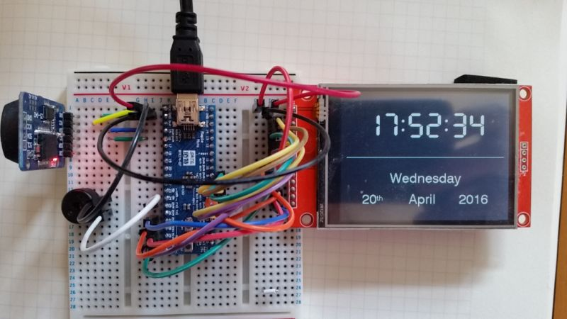

# Digital Clock

## Introduction

Yet another Arduino clock project.

## Hardware

All components were sourced from Ebay.co.uk.

Component               | Cost      | Notes
------------------------|-----------|------------------------------------------
Maple Leaf Mini         | £2.81     | STM32 32-bit ARM Cortex-M3, 120KB/4KB.
240x320 SPI TFT LCD     | £3.89     | ILI9341 display, XPT2046 Cap Touch.
DS3231 Real-Time Clock  | £2.99     | AT24C32 I2C i/f with battery
Prototype board         | £1.09     | 7CM x 5CM
Pizo Buzzer             | N/A       | Spare out of an old PC build

### Breadboard Prototype
Inital breadboard prototype using a breadboard.

### Prototype board:
Prototype board using headers for connections. Pizo buzzer scavanged from a PC.

## Development Software

All software is open source. Doxygen and (G)VIM aren't necessary to build and
execute the code.

Component               | Vesion    | Download
------------------------|-----------|------------------------------------------
Arduino IDE             | 1.6.5     | https://www.arduino.cc/en/Main/Software
Arduino STM32 libs      | Latest    | https://github.com/rogerclarkmelbourne/Arduino_STM32
XPT2056 touch library   | Latest    | https://github.com/peverett/XPT2046
Doxygen                 | 1.8.9     | http://www.stack.nl/~dimitri/doxygen/
VIM/GVIM                | 7.4       | http://www.vim.org/

The XPT2046 touch library is a fork of the library originally developed by 
Spiros Papadimitriou (https://github.com/spapadim/XPT2046) with minor 
modifications for the Maple Leaf Mini STM32 APIs. 

